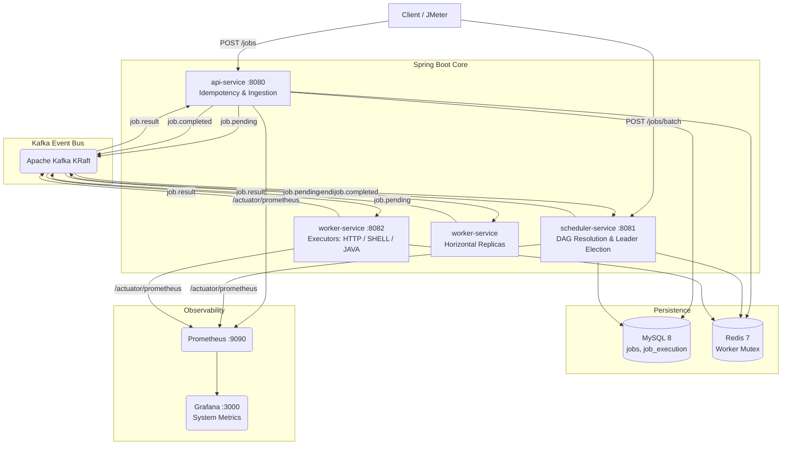
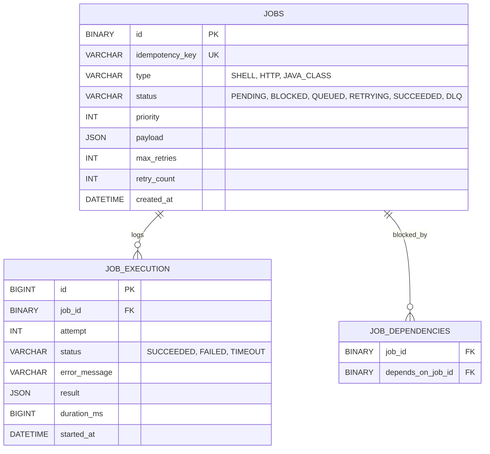
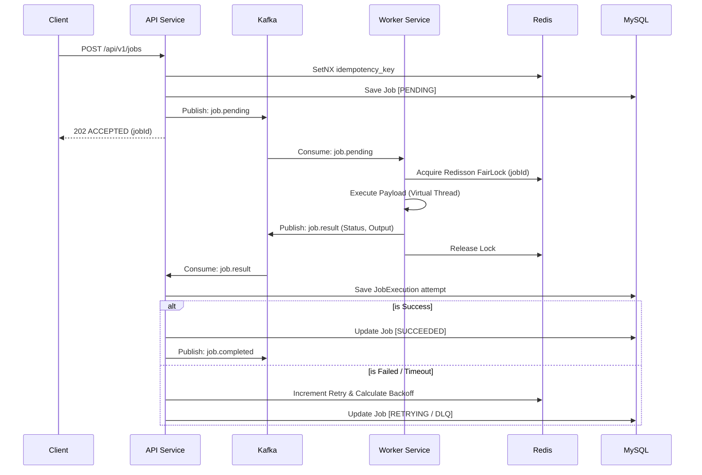

# 🔨 DistributedJobForge

> **Production-Grade Distributed Task Execution Engine**
> Java 21 · Spring Boot 3 · Kafka · Redis · MySQL · Virtual Threads · Prometheus · Grafana

DistributedJobForge is a highly scalable, fault-tolerant distributed job scheduling and execution engine. Built from the ground up with the same architectural patterns that power **AWS Lambda** and **Apache Airflow's** executor layer, this system guarantees exactly-once execution, supports complex DAG (Directed Acyclic Graph) job dependencies, and effortlessly processes massive workloads using Java 21 Virtual Threads.

---

## Table of Contents

1. [System Highlights](#system-highlights)
2. [High-Level Architecture](#high-level-architecture)
3. [Services Overview](#services-overview)
4. [Database Design](#database-design)
5. [Event-Driven Workflows](#event-driven-workflows)
6. [Observability Stack](#observability-stack)
7. [Performance Benchmarks](#performance-benchmarks)
8. [API Reference](#api-reference)
9. [Kafka Topics](#kafka-topics)
10. [Quick Start — Docker](#quick-start--docker-recommended)

---

## System Highlights

| Feature | Description | Technology |
|---|---|---|
| 🕸️ **DAG Dependencies** | Jobs can depend on multiple parent jobs. Topological sorting and DAG progression ensure jobs only run when parents succeed. | Kahn's Algorithm + Kafka |
| 🛡️ **Exactly-Once Execution** | Strict idempotency checks, Database-level UNIQUE constraints, and Redisson distributed locks prevent duplicate executions. | Redis + MySQL |
| 🧵 **High-Concurrency** | Blocking executions (e.g. HTTP, Shell) are offloaded to Virtual Threads, allowing thousands of concurrent jobs without OS thread exhaustion. | Java 21 Virtual Threads |
| 👑 **Leader Election** | Multi-replica Scheduler runs active-standby leader election to prevent duplicate reconciliation scans and watchdog interference. | Redisson RedLock |
| 📊 **Full Observability** | Custom throughput, latency, and queue depth metrics tracked and visualized in real-time. | Micrometer + Grafana |
| ♻️ **Exponential Backoff & DLQ** | Built-in retry mechanism with jitter. Exhausted jobs are pushed to a Dead Letter Queue which fires automated Webhook Alerts. | Spring Scheduling |

---

## High-Level Architecture

DistributedJobForge decouples ingestion, scheduling, and execution into highly specialized microservices, all choreographed asynchronously via Kafka.



---

## Services Overview

| Service | Port | Responsibility |
|---|---|---|
| **api-service** | 8080 | Single job REST API. Checks idempotency, saves to MySQL, publishes `job.pending`. Consumes `job.result` to update DB, manages exponential backoff retries, and fires DLQ Webhooks. |
| **scheduler-service** | 8081 | Batch REST API. Runs Kahn's Topological Sort for DAGs. Active-standby leader election. Consumes `job.completed` to unblock child jobs and publishes them to `job.pending`. |
| **worker-service** | 8082 | Kafka consumer. Acquires per-job Distributed Locks. Uses Pluggable Executors (`Shell`, `Http`, `JavaClass`) on Virtual Threads. Publishes `job.result`. Horizontally scalable. |
| **prometheus** | 9090 | Scrapes `/actuator/prometheus` from all services every 5s |
| **grafana** | 3000 | Dashboards — Live Worker Throughput, Jobs Submitted/Completed, DLQ, Latency |

---

## Database Design



---

## Event-Driven Workflows

### Standard Job Lifecycle

No synchronous waiting. Once a job enters Kafka, the client is free. The system guarantees eventual consistency.



---

## Observability Stack

DistributedJobForge ships with a **fully provisioned** monitoring stack using Micrometer metrics. Dashboards auto-load on container start.

### What's monitored

| Metric | Description |
|---|---|
| **Jobs Submitted** | Custom counter (`djf.jobs.submitted`) tracking ingest rate |
| **Worker Throughput** | Rate of `job.result` publications (jobs/sec) |
| **Execution Duration** | `Timer` measuring raw executor latency per job type |
| **DLQ / Retries** | Counters tracking failure rates and exponential backoffs |
| **HikariCP Pool** | Active vs Idle Database connection pool health |
| **Virtual Threads** | JDK 21 VT active/peak counts |

## Performance Benchmarks
Tested via Apache JMeter directly hammering the REST API to bypass UI caching, simulating a massive traffic spike across 3 horizontally scaled `worker-service` nodes.

| Concurrent Threads | Payload | Throughput | Max Latency | Error Rate |
|-----------------|--------------|--------------|--------------|------------|
| 200             | 20,000 Jobs  | 1,735 req/min| 1.4s        | 0%         |
| 500 (Extreme)   | 100,000 Jobs | 2,994 req/min| 35.0s*      | 1.45%**    |

*\*Latency spike due to intended queue buildup.*  
*\*\*1.45% Error Rate at 100k jobs strictly due to intentional 30s HikariCP database connection pool timeout (Default 10 connections shared across 500 threads). Zero data loss or corruption occurred.*

---

## API Reference

| Domain | Method | Endpoint | Description |
|---|---|---|---|
| **Jobs** | POST | `/api/v1/jobs` | Submit a single job |
| | GET | `/api/v1/jobs/{id}` | Get real-time job status and execution history |
| | DELETE | `/api/v1/jobs/{id}` | Cancel a pending or queued job |
| **Batches/DAG** | POST | `/api/v1/jobs/batch` | Submit an array of jobs. Supports `dependsOn` client references. Runs Topological Sort. |

---

## Kafka Topics

| Topic | Partitions | Producer | Consumers | Purpose |
|---|---|---|---|---|
| `job.pending` | 12 | api-service, scheduler | worker-service | Main execution queue |
| `job.result` | 6 | worker-service | api-service | Contains execution stdout/stderr & status |
| `job.completed` | 6 | api-service | scheduler-service | Triggers DAG unblocking for dependent child jobs |
| `job.dlq` | 3 | api-service | api-service | Triggers SMTP/Webhook alerts for exhausted jobs |

---

## Quick Start — Docker (Recommended)

> ✅ **This is the easiest way to run the platform.** One command starts everything — all 3 Spring Boot services, Kafka, MySQL, Redis, Prometheus, and Grafana.

### Prerequisites
- [Docker Desktop](https://www.docker.com/products/docker-desktop/) installed and running

### Step 1 — Clone & Start

```bash
git clone https://github.com/shrey200634/DistributedJobForge.git
cd DistributedJobForge

# Start the entire infrastructure and microservices
docker compose up --build -d
```

### Step 2 — Scale Workers (Optional for High Availability)

```bash
# Spin up 3 parallel execution nodes
docker compose up --scale worker-service=3 -d
```

### Step 3 — Access the Dashboards

| Tool | URL | Credentials |
|---|---|---|
| 🌐 Grafana | http://localhost:3000 | `admin` / `admin` |
| 📈 Prometheus | http://localhost:9090 | — |
| 📨 API | http://localhost:8080/api/v1/jobs | — |

---

### Run the JMeter Stress Test
To reproduce the extreme load test benchmarks:
1. Download Apache JMeter.
2. Open `stress_test_extreme.jmx` from the repository root.
3. Hit the Green Play Button and watch the Grafana dashboard throughput spike!

---
<p align="center">Built with ☕ Java 21, 🐘 Kafka, and a lot of Virtual Threads.</p>
