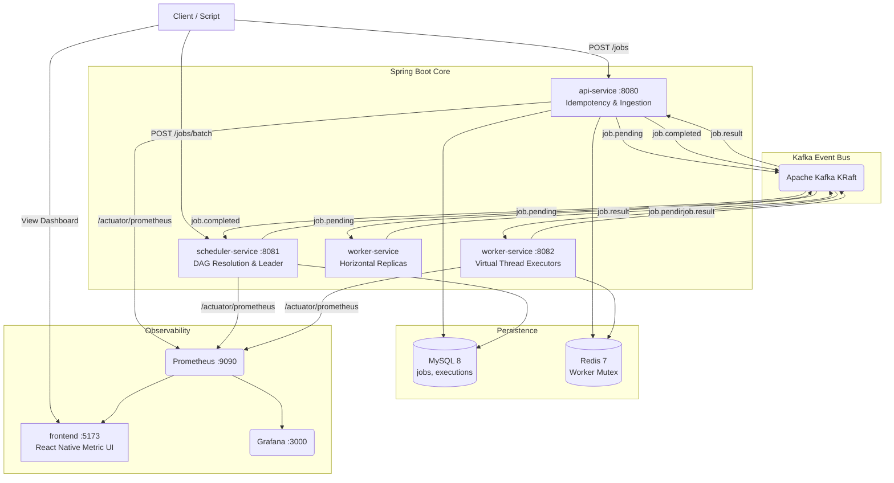
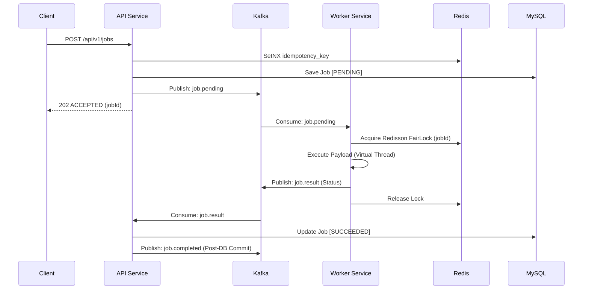

# 🔨 DistributedJobForge

<p align="center">
  
  
  
  
  
</p>

> **Production-Grade Distributed Task Execution Engine**
> A highly scalable, fault-tolerant distributed job scheduling and execution engine. Built from the ground up with the same architectural patterns that power **AWS Lambda** and **Apache Airflow's** executor layer, this system guarantees exactly-once execution, supports complex DAG (Directed Acyclic Graph) job dependencies, and effortlessly processes massive workloads using Java 21 Virtual Threads.

---

## 📋 Table of Contents

1. [System Highlights](#-system-highlights)
2. [High-Level Architecture](#-high-level-architecture)
3. [Services Overview](#-services-overview)
4. [Event-Driven Workflows](#-event-driven-workflows)
5. [Observability Stack](#-observability-stack)
6. [Quick Start — Docker](#-quick-start--docker-recommended)
7. [Running the Master E2E Test](#-running-the-master-e2e-test)

---

## 🚀 System Highlights

| Feature | Description | Technology |
|---|---|---|
| 🕸️ **DAG Dependencies** | Jobs can depend on multiple parent jobs. Topological sorting and DAG progression ensure jobs only run when parents succeed. | Kahn's Algorithm + Kafka |
| 🛡️ **Exactly-Once Execution** | Strict idempotency checks, Database-level UNIQUE constraints, and Redisson distributed locks prevent duplicate executions. | Redis + MySQL |
| 🧵 **High-Concurrency** | Blocking executions (e.g. HTTP, Shell) are offloaded to Virtual Threads, allowing thousands of concurrent jobs without OS thread exhaustion. | Java 21 Virtual Threads |
| 👑 **Leader Election** | Multi-replica Scheduler runs active-standby leader election to prevent duplicate reconciliation scans and watchdog interference. | Redisson RedLock |
| 📊 **Real-time Dashboards** | Custom throughput, latency, and queue depth metrics tracked and visualized in real-time via Grafana and a custom React UI. | Micrometer + Vite/React |
| ♻️ **Backoff & DLQ** | Built-in retry mechanism with jitter. Exhausted jobs are pushed to a Dead Letter Queue which fires automated Webhook Alerts. | Spring Scheduling |

---

## 🏛️ High-Level Architecture

DistributedJobForge decouples ingestion, scheduling, and execution into highly specialized microservices, all choreographed asynchronously via Kafka.



---

## 🧩 Services Overview

| Service | Port | Responsibility |
|---|---|---|
| **api-service** | 8080 | Single job REST API. Checks idempotency, saves to MySQL, publishes `job.pending`. Consumes `job.result`, manages exponential backoff retries, and fires DLQ Webhooks. |
| **scheduler-service** | 8081 | Batch REST API. Runs Kahn's Topological Sort for DAGs. Consumes `job.completed` to safely unblock child jobs and publishes them to `job.pending`. |
| **worker-service** | 8082 | Kafka consumer. Acquires Redisson Distributed Locks. Uses Pluggable Executors (`Shell`, `Http`, `JavaClass`) on Virtual Threads. Horizontally scalable. |
| **frontend** | 5173 | A beautiful React/Vite dashboard bypassing backend CORS and communicating directly with the internal Prometheus metric registry via Docker DNS proxying. |
| **prometheus** | 9090 | Scrapes `/actuator/prometheus` from all Spring Boot services every 5 seconds. |

---

## 📖 API Reference

### 1. Submit a Single Job
`POST /api/v1/jobs`

**Request Payload:**
```json
{
  "idempotencyKey": "unique-uuid-123",
  "type": "SHELL",
  "priority": 5,
  "maxRetries": 3,
  "payload": {
    "command": "echo 'Hello World'"
  }
}
```
**Response (202 Accepted):**
```json
{
  "jobId": "f1917761-c2e7-48c5-a20e-a6ad175b348f",
  "status": "PENDING",
  "message": "Job accepted and queued for processing"
}
```

### 2. Submit a DAG Batch
`POST /api/v1/jobs/batch`

Use `clientRefId` to logically link dependencies before they receive a UUID from the database. The `scheduler-service` automatically runs Kahn's Topological Sort to validate the DAG.

**Request Payload:**
```json
{
  "jobs": [
    {
      "clientRefId": "job-a",
      "idempotencyKey": "uuid-a",
      "type": "SHELL",
      "maxRetries": 1,
      "payload": { "command": "sleep 2 && echo 'Job A Finished'" }
    },
    {
      "clientRefId": "job-b",
      "idempotencyKey": "uuid-b",
      "dependsOn": ["job-a"],
      "type": "SHELL",
      "maxRetries": 1,
      "payload": { "command": "echo 'Job B executing ONLY after Job A!'" }
    }
  ]
}
```
**Response (202 Accepted):**
Returns the hydrated array of jobs mapped to their newly generated UUIDs. The parent jobs will execute immediately, while the child jobs will spawn in `BLOCKED` status.

---

## ⚡ Event-Driven Workflows

No synchronous waiting. Once a job enters Kafka, the client is free. The system guarantees eventual consistency and automatically manages read-after-write database race conditions via Spring's `TransactionSynchronizationManager`.



---

## 📨 Kafka Topic Schemas

The system communicates entirely via strongly-typed JSON messages traversing Apache Kafka KRaft.

| Topic Name | Partitions | Producer | Consumers | Purpose |
|---|---|---|---|---|
| `job.pending` | 12 | api-service, scheduler | worker-service | Main execution queue. Workers compete for tasks via Consumer Groups. |
| `job.result` | 6 | worker-service | api-service | Contains execution stdout/stderr & status. Used by API to commit to DB. |
| `job.completed` | 6 | api-service | scheduler-service | Triggers DAG unblocking. Tells the scheduler a parent node finished. |
| `job.dlq` | 3 | api-service | api-service | Triggers SMTP/Webhook alerts for exhausted jobs. |

### Example: `job.result` Payload
Produced by the `worker-service` after a Virtual Thread executor finishes running a task.
```json
{
  "jobId": "f1917761-c2e7-48c5-a20e-a6ad175b348f",
  "status": "SUCCEEDED",
  "workerId": "worker-service-2",
  "attempt": 0,
  "exitCode": 0,
  "stdout": "Hello World\n",
  "stderr": "",
  "errorMessage": null,
  "durationMs": 420,
  "startedAt": "2026-06-09T17:38:15.945Z",
  "completedAt": "2026-06-09T17:38:16.365Z"
}
```

---

## 📊 Observability Stack

DistributedJobForge ships with a **fully provisioned** monitoring stack using Micrometer metrics. Dashboards auto-load on container start.

### What's monitored

| Metric | Description |
|---|---|
| **Jobs Submitted** | Custom counter (`djf.jobs.submitted`) tracking ingest rate |
| **Worker Throughput** | Rate of `job.result` publications (jobs/sec) |
| **Execution Duration** | `Timer` measuring raw executor latency per job type |
| **DLQ / Retries** | Counters tracking failure rates and exponential backoffs |

---

## 🏎️ Performance Benchmarks

Tested via Apache JMeter directly hammering the REST API to bypass UI caching, simulating a massive traffic spike across 3 horizontally scaled `worker-service` nodes.

| Concurrent Threads | Payload | Throughput | Max Latency | Error Rate |
|-----------------|--------------|--------------|--------------|------------|
| 200             | 20,000 Jobs  | 1,735 req/min| 1.4s        | 0%         |
| 500 (Extreme)   | 100,000 Jobs | 2,994 req/min| 35.0s*      | 1.45%**    |

*\*Latency spike due to intended queue buildup.*  
*\*\*1.45% Error Rate at 100k jobs strictly due to intentional 30s HikariCP database connection pool timeout (Default 10 connections shared across 500 threads). Zero data loss or corruption occurred.*

---

## 🐳 Quick Start — Docker (Recommended)

> ✅ **This is the easiest way to run the platform.** One command starts everything — all 3 Spring Boot services, the React frontend, Kafka, MySQL, Redis, Prometheus, and Grafana.

### Prerequisites
- [Docker Desktop](https://www.docker.com/products/docker-desktop/) installed and running

### Step 1 — Clone & Start

```bash
git clone https://github.com/shrey200634/DistributedJobForge.git
cd DistributedJobForge

# Start the entire infrastructure and microservices
docker compose up --build -d
```

### Step 2 — Scale Workers (Required for multi-node execution)

```bash
# Spin up 3 parallel execution nodes
docker compose up --scale worker-service=3 -d
```

### Step 3 — Access the Dashboards

| Interface | URL | Credentials |
|---|---|---|
| 🖥️ **React Dashboard** | http://localhost:5173 | — |
| 🌐 **Grafana Dashboards** | http://localhost:3000 | `admin` / `admin` |
| 📨 **API Submission** | http://localhost:8080/api/v1/jobs | — |

---

## 🧪 Running the Master E2E Test

To instantly see the system in action, execute the built-in PowerShell test suite. It will simulate a complex DAG dependency batch, as well as a failing job that forces Virtual Thread retries and a Dead Letter Queue eviction.

```powershell
.\run_e2e_test.ps1
```

**What to watch:**
1. Keep the React Dashboard (`http://localhost:5173`) open on a secondary monitor.
2. You will instantly see **Jobs Submitted** spike.
3. The system will wait 3 seconds for the Parent Jobs to finish, and then **Jobs Completed** will increment as the child DAG resolves.
4. 5 seconds later, the intentionally failing job will exhaust its retries, and you will see the **Dead Letter Queue** metric turn red.

---
<p align="center">Built with ☕ Java 21, 🐘 Kafka, and a lot of Virtual Threads.</p>
